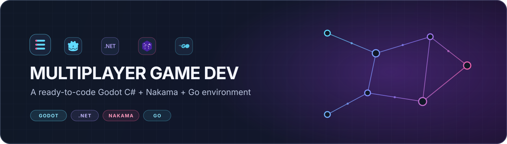
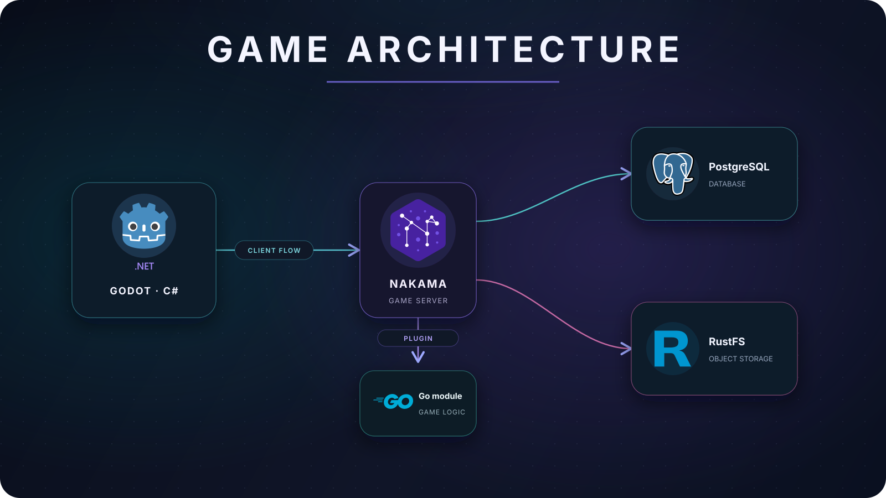

<div align="center">
  

  <p>
    <a href="https://godotengine.org/download/"></a>
    <a href="https://dotnet.microsoft.com/en-us/apps/games"></a>
    <a href="https://heroiclabs.com/nakama/"></a>
    <a href="https://go.dev/"></a>
  </p>

  <p>
    <a href="https://vscode.dev/redirect?url=vscode://vscode.git/clone?url=https://github.com/EpicSpartanRyan/GodotNakama">
      
    </a>
  </p>
</div>

---

## ✨ What is this?

A VS Code Dev Container workspace for developing a **Godot C# game** alongside a **Go/Nakama multiplayer backend**. It brings the editor, backend, database, object storage, and art tools together in one development setup.

| 🧩 Included | 🛠️ Purpose |
| --- | --- |
| Godot .NET + C# | Build and run the game |
| Nakama + Go | Develop multiplayer logic |
| PostgreSQL | Store Nakama data |
| RustFS | S3-compatible object storage |
| Aseprite + Inochi | Create 2D/3D assets |
| VSCode Dev Containers | Consistent dev environment |

## 🧭 Architecture



Nakama loads the Go server module; client multiplayer integration is still in progress.

## 🚀 Get started

<details open>
<summary><strong>Quick start</strong></summary>

1. Install [Docker](https://docs.docker.com/get-docker/), [VS Code](https://code.visualstudio.com/) and the [Dev Containers extension](https://marketplace.visualstudio.com/items?itemName=ms-vscode-remote.remote-containers). Create a repository from this template, clone it.
2. In VS Code, run **Dev Containers: Reopen in Container**. The default uses WSLg (GPU); other profiles are listed below. The container starts Godot, PostgreSQL, RustFS, and Nakama, which runs its database migrations.
3. Run **Templates: Instantiate**, add any required credentials locally (never commit secrets), then start the game with **Godot: Start** or `godot -e --path client/sample-game`.

</details>

<details>
<summary><strong>Choose a Dev Container profile</strong></summary>

| Profile | Host | Rendering | Notes |
| --- | --- | --- | --- |
| `linux-nvidia` | Linux | NVIDIA GPU | Requires NVIDIA drivers and NVIDIA Container Toolkit |
| `linux-cpu` | Linux | Software | No NVIDIA runtime; software rendering may be slower |
| `windows-wslg-nvidia` | Ubuntu on WSL2 with WSLg | WSLg GPU | Requires WSLg and compatible GPU support |
| `windows-wslg-cpu` | Ubuntu on WSL2 with WSLg | Software | No NVIDIA runtime or `/dev/dxg` device |

The shared service stack and VS Code tooling are composed with host-specific display and renderer overlays.

</details>

<details>
<summary><strong>Host requirements and compatibility</strong></summary>

Supported graphical hosts are Linux with X11 or Wayland, and Ubuntu on WSL2 with WSLg. Docker Engine or Docker Desktop with Compose is required. NVIDIA Container Toolkit is needed only for the NVIDIA profiles.

The GUI profiles are not intended for macOS as a direct host, Windows without WSLg or another display bridge, or Docker hosts without access to the required display socket. GPU profiles require the relevant host GPU/driver support. CPU profiles use Mesa software rendering and can be significantly slower.

The Compose credentials are for local development only. Do not reuse them in production.

</details>

## 🐳 Services

| Service | Port(s) | Purpose |
| --- | ---: | --- |
| PostgreSQL | `5432` | Nakama database |
| Nakama | `7349`, `7350` , `7351` | gRPC, realtime API, and console |
| RustFS | `9000` | S3-compatible object storage |
| Godot | `6007`, `6008` | Remote debugger and language server |

<details>
<summary><strong>Start the Linux NVIDIA stack manually</strong></summary>

Run from the repository root:

```bash
docker compose --env-file versions.env \
  -f .devcontainer/docker-compose.yml \
  -f .devcontainer/compose/linux.yml \
  -f .devcontainer/compose/linux-gpu.yml \
  up -d --build
```

Inspect services and logs:

```bash
docker compose --env-file versions.env \
  -f .devcontainer/docker-compose.yml \
  -f .devcontainer/compose/linux.yml \
  -f .devcontainer/compose/linux-gpu.yml \
  ps

docker compose --env-file versions.env \
  -f .devcontainer/docker-compose.yml \
  -f .devcontainer/compose/linux.yml \
  -f .devcontainer/compose/linux-gpu.yml \
  logs -f nakama postgres rustfs
```

For CPU-only Linux, replace `linux-gpu.yml` with `cpu.yml`. On WSLg, replace `linux.yml` with `wslg.yml`; use `wslg-gpu.yml` for GPU or `cpu.yml` for software rendering. Use the same Compose file list with `down` to stop the stack.

</details>

## 🧰 Build, test, and useful tasks

<details>
<summary><strong>Build and test</strong></summary>

Build the game:

```bash
dotnet build client/sample-game/Sample-Game.sln
```

Run the C# tests:

```bash
dotnet test client/sample-game.Tests/Sample-Game.Tests.csproj
```

Run the Nakama backend tests:

```bash
cd backend && go test --mod=vendor ./...
```

The C# test project targets .NET 10 and uses xUnit v3. Its dependencies, including Testcontainers, are isolated from the exported game, which targets .NET 8. The backend tests use Testify; Docker is required because the RustFS integration test starts a throwaway container.

</details>

<details>
<summary><strong>VS Code task shortcuts</strong></summary>

- 🎮 **Godot:** Build, Export Game, Install Addons, Start
- 🕹️ **Nakama:** Go Vendor, Test, Build & Restart
- 🐳 **Docker:** View Logs (Nakama / DB)
- 🩺 **Environment:** Run Doctor
- 🎨 **Art tools:** Aseprite, Inochi
- 🧪 **.NET:** Test

Run `./doctor.sh` or **Environment: Run Doctor** to check tools, display/GPU access, Docker, services, and network connectivity. Hardware checks depend on the host and active display session.

</details>

<details>
<summary><strong>🔁 CI and deployment</strong></summary>

GitHub Actions builds and tests the C# projects, builds the Nakama Go plugin, and exports the game for Windows, Linux, and macOS on pushes and pull requests to `main`. A separate workflow builds and publishes the development image; Nakama deployment is manual.

Build artifacts are temporary CI artifacts, not signed releases. Workflows that use GitHub secrets or remote deployment need suitable configuration. Local runs through the `Act:` tasks also require `act`.

</details>

<details>
<summary><strong>📌 Versions</strong></summary>

The shared tool-version inventory is in [`versions.env`](./versions.env). Dev Container feature versions and digests are recorded in each profile's lockfile. The Dockerfile also pins direct APT packages. The environment is not fully bit-for-bit reproducible: base images, transitive OS packages, and downloaded artifacts are not all pinned by digest or checksum.

</details>

## 🆘 Troubleshooting

<details>
<summary><strong>Common issues</strong></summary>

- **Container startup fails:** check Docker/Compose, the selected profile, and the host-specific display mounts.
- **Godot or an art tool cannot open a window:** check `DISPLAY`, `WAYLAND_DISPLAY`, `XDG_RUNTIME_DIR`, and display socket access.
- **NVIDIA profile fails:** verify host NVIDIA drivers and NVIDIA Container Toolkit; use a CPU profile if GPU passthrough is unavailable.
- **Nakama is unavailable:** inspect Compose status and logs for `nakama`, `postgres`, and `rustfs`.
- **Wrong .NET SDK:** run `dotnet --version`; [`global.json`](./global.json) selects the SDK.

</details>

---

## 📈 Repository activity


<div align="center">
  <sub>Built for multiplayer game development 🎮 · Powered by Godot, Nakama, Go, and .NET</sub>
</div>
